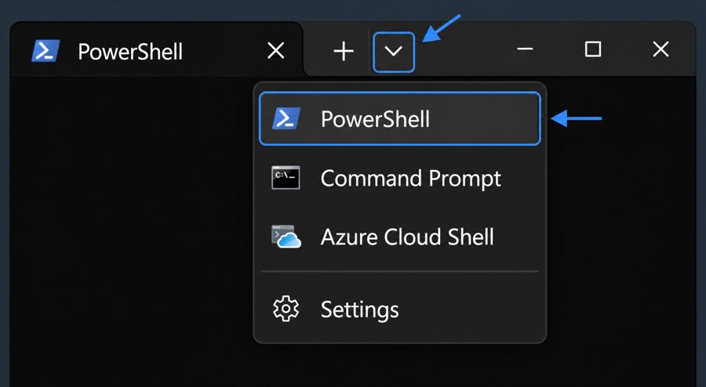

# Windows setup

Use **Windows Terminal with a PowerShell tab** for all commands in this guide.

## 1. Open Windows Terminal

1. Open the Windows **Start** menu.
2. Search for **Terminal** and open **Windows Terminal**.
3. Confirm that the active tab is labeled **PowerShell**. If it is not, select the arrow next to the **+** button and choose **PowerShell**.



*The exact appearance may vary depending on the installed Windows Terminal version.*

Check your current folder:

```powershell
pwd
```

It should be your user folder, similar to `C:\Users\StudentName`. If it shows another location, such as `C:\Windows\System32`, move to your user folder:

```powershell
cd $HOME
```

## 2. Check Git

```powershell
git --version
```

If Windows reports that `git` is not recognized, download and install [Git for Windows](https://git-scm.com/install/windows). **Close and reopen Windows Terminal** after the installation, then run `git --version` again before continuing.

## 3. Install uv

Run this command in the PowerShell tab:

```powershell
powershell -ExecutionPolicy ByPass -c "irm https://astral.sh/uv/install.ps1 | iex"
```

**Close and reopen Windows Terminal**, then verify the installation:

```powershell
uv --version
```

Continue with [Clone the project](../README.md#clone-the-project) in the project README.
